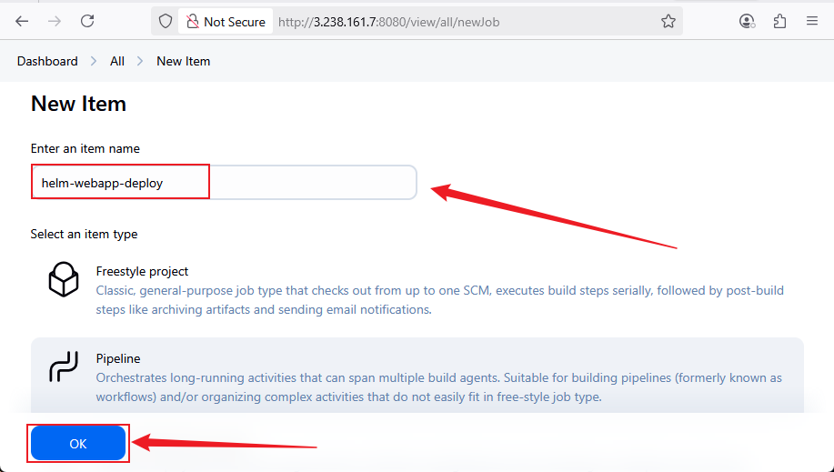

# 🚀 Integrating Helm with CI/CD using Jenkins and EKS

## Introduction

This project demonstrates how to integrate Helm with Jenkins to build a continuous integration and continuous deployment (CI/CD) pipeline that automates application deployments to an Amazon EKS (Elastic Kubernetes Service) cluster. The Jenkins server runs on an EC2 instance provisioned with Terraform, and the pipeline deploys Helm charts to manage Kubernetes resources efficiently.

## Project Overview

The goal is to create an automated deployment pipeline where:

- Jenkins monitors a GitHub repository containing Helm charts.
- On each commit, Jenkins triggers a pipeline that deploys or updates the application on EKS using Helm commands.
- Infrastructure, including the Jenkins server on EC2, is provisioned via Terraform for repeatability and scalability.
- The Helm chart is customized to adjust application replicas and resource requests dynamically.

## Prerequisites

Before starting, ensure you have the following:

- An AWS account with permissions to create EC2, EKS, IAM roles, and other resources.
- Terraform installed and configured locally (`terraform` CLI and AWS CLI configured with `aws configure`).
- Access to an existing EKS cluster or willingness to provision one (optionally via Terraform).
- Helm CLI installed (on the Jenkins EC2 instance).
- Jenkins installed on an EC2 instance (provisioned via Terraform).
- Git installed locally for version control and pushing code.
- A Kubernetes context configured to allow Helm deployments to the target EKS cluster.
- Basic knowledge of Kubernetes, Helm, Terraform, and Jenkins pipelines.

## Tools and Technologies Used

| Tool/Technology       | Purpose                                                        |
|----------------------|----------------------------------------------------------------|
| **Terraform**         | Infrastructure provisioning (EC2, optionally EKS, IAM roles)  |
| **AWS EC2**           | Hosts the Jenkins server                                        |
| **Amazon EKS**        | Managed Kubernetes cluster for deploying the app               |
| **Jenkins**           | CI/CD automation server running on EC2                         |
| **Helm**              | Kubernetes package manager for deploying and managing releases |
| **Docker**            | Containerize the application (optional depending on app)       |
| **Git & GitHub**      | Source control and pipeline triggers                            |
| **kubectl**           | Kubernetes CLI for interacting with EKS                        |
| **IAM Roles**         | Secure AWS access between Jenkins and EKS                      |

## Project Structure

```bash
helm-jenkins-eks-cicd/
├── terraform/
│   ├── ec2/
│   ├── eks/
│   ├── provider.tf
│   └── terraform.tfvars
├── webapp/                # Helm chart created by `helm create webapp`
│   ├── Chart.yaml
│   ├── values.yaml
│   └── templates/
├── Dockerfile             # Dockerfile at root or wherever your app source is
├── Jenkinsfile
├── README.md
├── main.tf                # Root terraform
├── variables.tf           # Root terraform variables
├── outputs.tf             # Root terraform outputs
├── .gitignore
└── LICENSE (optional)
```

## **Task 1: Setup Project Folder and Directory** Structure

### Step 1: Create the Project Root Folder

Run this command in your desired workspace directory (e.g., `Documents/DevOps_WorkSpace_Projects/DAREY.IO_PROJECTS`):

```bash
mkdir helm-jenkins-eks-cicd
cd helm-jenkins-eks-cicd
```

**Screenshot:**


### Step 2: Create Project Subdirectories and Placeholder Files

Run this command inside the newly created project root folder to create Terraform folders, Helm chart folders, and key root files:

```bash
mkdir -p terraform/ec2
mkdir -p terraform/eks
mkdir -p webapp/templates

touch terraform/provider.tf
touch terraform/terraform.tfvars

touch terraform/ec2/main.tf
touch terraform/ec2/variables.tf
touch terraform/ec2/outputs.tf
touch terraform/ec2/user_data.sh

touch terraform/vpc/main.tf
touch terraform/vpc/variables.tf
touch terraform/vpc/outputs.tf

touch terraform/eks/main.tf
touch terraform/eks/variables.tf
touch terraform/eks/outputs.tf
touch terraform/eks/iam.tf
touch terraform/eks/security_groups.tf

touch Jenkinsfile
touch README.md
touch .gitignore
```
**Screenshot:**


## Task 3: Provision VPC, Subnet, Internet Gateway (Networking Foundation)

### Step 1: Create `terraform/vpc/main.tf`

```hcl
resource "aws_vpc" "main" {
  cidr_block           = var.vpc_cidr
  enable_dns_support   = true
  enable_dns_hostnames = true

  tags = {
    Name = var.vpc_name
  }
}

resource "aws_internet_gateway" "gw" {
  vpc_id = aws_vpc.main.id

  tags = {
    Name = "${var.vpc_name}-igw"
  }
}

resource "aws_subnet" "public" {
  vpc_id                  = aws_vpc.main.id
  cidr_block              = var.public_subnet_cidr
  map_public_ip_on_launch = true
  availability_zone       = var.availability_zone

  tags = {
    Name = "${var.vpc_name}-public-subnet"
  }
}

resource "aws_route_table" "public" {
  vpc_id = aws_vpc.main.id

  tags = {
    Name = "${var.vpc_name}-public-rt"
  }
}

resource "aws_route_table_association" "public_association" {
  subnet_id      = aws_subnet.public.id
  route_table_id = aws_route_table.public.id
}

resource "aws_route" "default_route" {
  route_table_id         = aws_route_table.public.id
  destination_cidr_block = "0.0.0.0/0"
  gateway_id             = aws_internet_gateway.gw.id
}
```


### Step 2: Create `terraform/vpc/variables.tf`

```hcl
variable "vpc_cidr" {
  description = "CIDR block for the VPC"
  type        = string
  default     = "10.0.0.0/16"
}

variable "vpc_name" {
  description = "Name tag for the VPC"
  type        = string
  default     = "main-vpc"
}

variable "public_subnet_cidr" {
  description = "CIDR block for the public subnet"
  type        = string
  default     = "10.0.1.0/24"
}

variable "availability_zone" {
  description = "Availability zone for the subnet"
  type        = string
  default     = "us-east-1a"
}
```

### Step 3: Create `terraform/vpc/outputs.tf`

```hcl
output "vpc_id" {
  value = aws_vpc.main.id
}

output "public_subnet_id" {
  value = aws_subnet.public.id
}
```

### Step 4: Add VPC module call to root `main.tf`

```hcl
module "vpc" {
  source             = "./terraform/vpc"
  vpc_cidr           = "10.0.0.0/16"
  vpc_name           = "main-vpc"
  public_subnet_cidr = "10.0.1.0/24"
  availability_zone  = "us-east-1a"
}
```

## Task 4: Provision EC2 for Jenkins with User Data to Install Jenkins & Helm

### Step 1: Create `terraform/ec2/main.tf`

```hcl
# Create a key pair from your local public key file
resource "aws_key_pair" "this" {
  key_name   = "helm_jenkins_key"
  public_key = file("C:/Users/oluph/.ssh/helm_jenkins_key.pub")
}

# Security group for Jenkins EC2 instance
resource "aws_security_group" "jenkins_sg" {
  name        = "jenkins_sg"
  description = "Allow HTTP, SSH to Jenkins"
  vpc_id      = var.vpc_id

  ingress {
    description = "SSH"
    from_port   = 22
    to_port     = 22
    protocol    = "tcp"
    cidr_blocks = ["0.0.0.0/0"]
  }

  ingress {
    description = "HTTP for Jenkins"
    from_port   = 8080
    to_port     = 8080
    protocol    = "tcp"
    cidr_blocks = ["0.0.0.0/0"]
  }

  egress {
    from_port   = 0
    to_port     = 0
    protocol    = "-1"
    cidr_blocks = ["0.0.0.0/0"]
  }
}

# EC2 instance to host Jenkins
resource "aws_instance" "jenkins_ec2" {
  ami                    = var.ami_id                # Example: Amazon Linux 2 AMI
  instance_type          = var.instance_type         # Example: t3.micro
  key_name               = aws_key_pair.this.key_name
  vpc_security_group_ids = [aws_security_group.jenkins_sg.id]
  subnet_id              = var.subnet_id             # From your VPC module
  user_data              = file("${path.module}/user_data.sh")  # Script to install Jenkins & Helm

  tags = {
    Name = "JenkinsServer"
  }
}
```

### Step 2: Create `terraform/ec2/variables.tf`

```hcl
variable "ami_id" {
  description = "AMI ID for the EC2 instance"
  type        = string
}

variable "instance_type" {
  description = "EC2 instance type"
  type        = string
  default     = "t3.micro"
}

variable "key_pair_name" {
  description = "SSH key pair name for EC2"
  type        = string
}

variable "vpc_id" {
  description = "VPC ID for the EC2 instance"
  type        = string
}

variable "subnet_id" {
  description = "Subnet ID for the EC2 instance"
  type        = string
}
```
### Step 3: Create `terraform/ec2/outputs.tf`

```hcl
output "jenkins_public_ip" {
  value = aws_instance.jenkins_ec2.public_ip
}

output "jenkins_public_dns" {
  value = aws_instance.jenkins_ec2.public_dns
}
```

### Step 4: Create `terraform/ec2/user_data.sh`

```bash
#!/bin/bash
# Update the system
dnf update -y

# Install Java 17 (required for Jenkins)
dnf install -y java-17-amazon-corretto

# Install Git (for Jenkins pipeline)
dnf install -y git

# Add Jenkins repo and import key
wget https://pkg.jenkins.io/redhat-stable/jenkins.io-2023.repo -O /etc/yum.repos.d/jenkins.repo
rpm --import https://pkg.jenkins.io/redhat-stable/jenkins.io.key

# Install Jenkins
dnf install -y jenkins

# Enable and start Jenkins
systemctl enable jenkins
systemctl start jenkins

# Install Docker
dnf install -y docker
systemctl start docker
systemctl enable docker
usermod -a -G docker ec2-user

# Install Helm (latest)
curl https://raw.githubusercontent.com/helm/helm/main/scripts/get-helm-3 | bash

# Print versions for verification
java -version
docker --version
helm version
```

### Step 5: Update root `main.tf` to call EC2 module with outputs from VPC

```hcl
module "ec2_jenkins" {
  source         = "./ec2"
  ami_id         = "ami-05ffe3c48a9991133"
  instance_type  = "t3.micro"
  key_pair_name  = "helm_keypair"
  vpc_id         = module.vpc.vpc_id
  subnet_id      = module.vpc.public_subnet_az1
}
```
### Step 6: Terraform workflow

From your project root:

```bash
terraform init
terraform apply
```

This will create the VPC, subnet, and then the EC2 instance configured with Jenkins and Helm installed.

## ✅ Task 5: Provision EKS Cluster Using Terraform

### 🎯 **Goal**: Provision an Amazon EKS cluster with required IAM roles, security groups, and networking using Terraform modules.

### ✅ Step 1: Create `terraform/eks/main.tf`

```hcl
resource "aws_eks_cluster" "eks" {
  name     = var.cluster_name
  role_arn = aws_iam_role.eks_cluster_role.arn

  vpc_config {
    subnet_ids         = var.subnet_ids
    security_group_ids = [aws_security_group.eks_sg.id]
  }

  depends_on = [aws_iam_role_policy_attachment.eks_cluster_AmazonEKSClusterPolicy]
}

resource "aws_eks_node_group" "eks_nodes" {
  cluster_name    = aws_eks_cluster.eks.name
  node_group_name = "${var.cluster_name}-node-group"
  node_role_arn   = aws_iam_role.eks_node_role.arn
  subnet_ids      = var.subnet_ids

  scaling_config {
    desired_size = 2
    max_size     = 3
    min_size     = 1
  }

  instance_types = [var.node_instance_type]
  depends_on = [
    aws_eks_cluster.eks,
    aws_iam_role_policy_attachment.eks_node_AmazonEKSWorkerNodePolicy,

    aws_iam_role_policy_attachment.eks_node_AmazonEC2ContainerRegistryReadOnly,
    aws_iam_role_policy_attachment.eks_node_AmazonEKS_CNI_Policy,
  ]
}
```
### ✅ Step 2: Create `terraform/eks/variables.tf`

```hcl
variable "cluster_name" {
  description = "Name of the EKS cluster"
  type        = string
}

variable "subnet_ids" {
  description = "List of subnet IDs"
  type        = list(string)
}

variable "vpc_id" {
  description = "VPC ID for the EKS cluster"
  type        = string
}

variable "node_instance_type" {
  description = "Instance type for worker nodes"
  type        = string
  default     = "t3.medium"
}
```

### ✅ Step 3: Create `terraform/eks/outputs.tf`

```hcl
output "cluster_name" {
  value = aws_eks_cluster.eks.name
}

output "cluster_endpoint" {
  value = aws_eks_cluster.eks.endpoint
}

output "cluster_ca_certificate" {
  value = aws_eks_cluster.eks.certificate_authority[0].data
}
```

### ✅ Step 4: Create `terraform/eks/iam.tf`

```hcl
resource "aws_iam_role" "eks_cluster_role" {
  name = "eks-cluster-role"
  assume_role_policy = data.aws_iam_policy_document.eks_cluster_assume_role.json
}

data "aws_iam_policy_document" "eks_cluster_assume_role" {
  statement {
    actions = ["sts:AssumeRole"]
    principals {
      type        = "Service"
      identifiers = ["eks.amazonaws.com"]
    }
  }
}

resource "aws_iam_role_policy_attachment" "eks_cluster_AmazonEKSClusterPolicy" {
  policy_arn = "arn:aws:iam::aws:policy/AmazonEKSClusterPolicy"
  role       = aws_iam_role.eks_cluster_role.name
}

resource "aws_iam_role" "eks_node_role" {
  name = "eks-node-role"
  assume_role_policy = data.aws_iam_policy_document.eks_node_assume_role.json
}

data "aws_iam_policy_document" "eks_node_assume_role" {
  statement {
    actions = ["sts:AssumeRole"]
    principals {
      type        = "Service"
      identifiers = ["ec2.amazonaws.com"]
    }
  }
}

resource "aws_iam_role_policy_attachment" "eks_node_AmazonEKSWorkerNodePolicy" {
  policy_arn = "arn:aws:iam::aws:policy/AmazonEKSWorkerNodePolicy"
  role       = aws_iam_role.eks_node_role.name
}

resource "aws_iam_role_policy_attachment" "eks_node_AmazonEC2ContainerRegistryReadOnly" {
  policy_arn = "arn:aws:iam::aws:policy/AmazonEC2ContainerRegistryReadOnly"
  role       = aws_iam_role.eks_node_role.name
}

resource "aws_iam_role_policy_attachment" "eks_node_AmazonEKS_CNI_Policy" {
  policy_arn = "arn:aws:iam::aws:policy/AmazonEKS_CNI_Policy"
  role       = aws_iam_role.eks_node_role.name
}
```

### ✅ Step 5: Create `terraform/eks/security_groups.tf`

```hcl
resource "aws_security_group" "eks_sg" {
  name        = "eks-cluster-sg"
  description = "Security group for EKS cluster communication"
  vpc_id      = var.vpc_id

  ingress {
    description = "Allow all within VPC"
    from_port   = 0
    to_port     = 0
    protocol    = "-1"
    cidr_blocks = ["10.0.0.0/16"] # Update based on your VPC CIDR
  }

  egress {
    from_port   = 0
    to_port     = 0
    protocol    = "-1"
    cidr_blocks = ["0.0.0.0/0"]
  }
}
```

### ✅ Step 6: Update `terraform/main.tf` (root)

```hcl
module "eks" {
  source            = "./eks"
  cluster_name      = "helm-eks-cluster"
  vpc_id            = module.vpc.vpc_id
  subnet_ids        = [
    module.vpc.public_subnet_az1,
    module.vpc.public_subnet_az2
  ]
  node_instance_type = "t3.medium"
}
```

### ✅ Step 7: Run Terraform

```bash
cd terraform
terraform init
terraform plan -out eks-plan
terraform apply eks-plan
```

## 🔧 **Task 6: Connect kubectl to EKS Cluster and Verify Access**

### 🎯 Objective

* Update your local `kubeconfig` to point to your new EKS cluster.
* Test access with `kubectl` to ensure it's properly connected.

### ✅ **Step 1: Install & Configure `kubectl` (if not installed)**

If `kubectl` is not yet installed:

```bash
curl.exe -LO https://dl.k8s.io/release/v1.30.1/bin/windows/amd64/kubectl.exe
```

Or follow the [official guide](https://kubernetes.io/docs/tasks/tools/install-kubectl-windows/) if on Windows.

**Screenshot**


### ✅ **Step 2: Update kubeconfig using AWS CLI**

```bash
aws eks --region us-east-1 update-kubeconfig --name helm-eks-cluster
```

**Screenshot**


This command sets the context to interact with your cluster via `kubectl`.

### ✅ **Step 3: Verify Cluster Connection**

```bash
kubectl get nodes
```

**Screenshot Expected Output:**

If you see the worker nodes, your connection is successful.

### ✅ Optional Step 4: View Cluster Info

```bash
kubectl cluster-info
```


## Task 7: Automate Helm Deployment with Jenkins Pipeline (CI/CD)

### 🎯 **Goal:**

Set up a Jenkins pipeline that automatically builds a Docker image, pushes it to Docker Hub, and deploys the app to Amazon EKS using Helm whenever changes are pushed to GitHub.

### 🛠️ Prerequisites

* Jenkins is running on your EC2 instance
* Docker is installed and Jenkins has permission to use it
* Helm is installed and configured
* Jenkins has access to your GitHub repo
* **Docker Hub credentials and AWS credentials are added in Jenkins (see below)**
* Your EKS cluster is working and `aws eks update-kubeconfig` has been run successfully on the Jenkins host or configured in the pipeline

### 📝 Step 1: Add AWS Credentials to Jenkins

1. Navigate to **Manage Jenkins > Credentials > (your domain)**.
2. Click **Add Credentials**.
3. Select **Username with password**.
4. For **Username**, enter your AWS Access Key ID.
5. For **Password**, enter your AWS Secret Access Key.
6. Set **ID** to `aws-cred` (or the same ID referenced in your Jenkinsfile).
7. Click **OK** to save.

> This credential will be used by Jenkins to authenticate AWS CLI commands for EKS operations.

### Step 2: How to Add Docker Hub Credentials in Jenkins

1. **Open Jenkins Dashboard**
   Log into your Jenkins web UI.

2. **Navigate to Manage Credentials**

   * Click on **Manage Jenkins** (usually on the left menu or from the dashboard).
   * Then click **Manage Credentials**.

3. **Choose a Credentials Domain**

   * Usually, you'll see one or more domains (e.g., `(global)` domain).
   * Click on `(global)` or the domain where you want to add credentials.

4. **Add Credentials**

   * Click **Add Credentials** (usually on the left sidebar or the main pane).

5. **Fill in the Credentials Details:**

   * **Kind:** Select **Username with password**
   * **Scope:** Choose **Global** (so it can be used anywhere in Jenkins)
   * **Username:** Your Docker Hub username (e.g., `your-docker-username`)
   * **Password:** Your Docker Hub password or better, a Docker Hub access token (recommended for security)
   * **ID:** `docker-cred` (This ID should match what you reference in your Jenkinsfile or pipeline script)
   * **Description:** Something like `"Docker Hub credentials"`

6. **Save**
   Click **OK** or **Save** to finish adding the credentials.

### Notes:

* It's recommended to use a **Docker Hub access token** (created from your Docker Hub account settings) instead of your actual password for better security.
* The **ID** is important because your Jenkins pipeline or freestyle job will refer to this credential ID to authenticate against Docker Hub.


### 📄 Step 3: Update Your Helm Chart

#### 1️⃣ Edit `webapp/values.yaml`

```yaml
replicaCount: 3
```

#### 2️⃣ Edit `webapp/templates/deployment.yaml`

Update resource requests:

```yaml
resources:
  requests:
    memory: "180Mi"
    cpu: "120m"
```

### 🐳 Step 4: Create a Dockerfile

```Dockerfile
FROM nginx:stable
COPY . /usr/share/nginx/html
EXPOSE 80
CMD ["nginx", "-g", "daemon off;"]
```

Also create a `.dockerignore`:

```
*.tar
*.zip
*.log
node_modules
.vscode
.git
*.lz4
```

### 📝 Step 5: Jenkinsfile for CI/CD

#### 1: Configure Automatic Build Trigger

Set Jenkins to automatically detect new commits in Git repository:

+ GitHub Webhook :

    Go to your GitHub repository settings.

    Navigate to Webhooks → Add webhook.

    Enter the URL for your Jenkins Git plugin:

http://44.203.206.24:8080/github-webhook/

    Select Push events.

    Save the webhook.

    Jenkins will now trigger builds when you push code to your GitHub repository.

#### 2: GitHub Credentials:

    In Jenkins, go to Manage Jenkins → Credentials.

    Add your GitHub username/password or token.

#### 3: Configure Jenkins Job
**Create a New Pipeline:**
1. In Jenkins dashboard, click **New Item > Pipeline**.
2. Name it `helm-webapp-deploy`.
3. Choose **Pipeline script from SCM**.
4. Choose **Git** and paste your GitHub repo URL.
5. Select the `main` branch.
6. Choose credentials if the repo is private.
7. Click **Save**.



#### 4: Set Up Pipeline:
     **Create a Jenkinsfile:**

```groovy
pipeline {
    agent any

    environment {
        AWS_REGION = 'us-east-1'
        IMAGE_NAME = 'holuphilix/my-webapp:latest'
        HELM_BIN = '/usr/local/bin/helm'
        KUBECONFIG = '/home/ec2-user/.kube/config'
    }

    triggers {
        githubPush() // Trigger the pipeline on GitHub push
    }

    stages {
        stage('Checkout') {
            steps {
                git url: 'https://github.com/Holuphilix/helm-jenkins-eks-cicd.git', branch: 'main'
            }
        }

        stage('Build & Push Docker Image') {
            steps {
                withCredentials([usernamePassword(
                    credentialsId: 'docker-cred', // Docker Hub credentials
                    usernameVariable: 'DOCKER_USERNAME',
                    passwordVariable: 'DOCKER_PASSWORD'
                )]) {
                    sh '''
                        echo "🔧 Building Docker image..."
                        docker build -t $IMAGE_NAME .

                        echo "🔐 Logging into Docker Hub..."
                        echo $DOCKER_PASSWORD | docker login -u $DOCKER_USERNAME --password-stdin

                        echo "📤 Pushing image to Docker Hub..."
                        docker push $IMAGE_NAME
                    '''
                }
            }
        }

        stage('Deploy to EKS with Helm') {
            steps {
                withCredentials([usernamePassword(
                    credentialsId: 'aws-cred', // AWS IAM programmatic credentials
                    usernameVariable: 'AWS_ACCESS_KEY_ID',
                    passwordVariable: 'AWS_SECRET_ACCESS_KEY'
                )]) {
                    sh '''
                        echo "⚙️ Configuring AWS CLI for EKS..."
                        export AWS_ACCESS_KEY_ID=$AWS_ACCESS_KEY_ID
                        export AWS_SECRET_ACCESS_KEY=$AWS_SECRET_ACCESS_KEY
                        export AWS_DEFAULT_REGION=$AWS_REGION

                        echo "📡 Updating kubeconfig for EKS cluster..."
                        aws eks update-kubeconfig --region $AWS_REGION --name helm-eks-cluster

                        echo "🚀 Deploying to EKS with Helm..."
                        $HELM_BIN upgrade --install my-webapp ./webapp --namespace default
                    '''
                }
            }
        }
    }

    post {
        success {
            echo '✅ Deployment succeeded!'
        }
        failure {
            echo '❌ Deployment failed. Check logs above.'
        }
    }
}
```
### Step 7: Test a deployment (e.g., NGINX):

```bash
kubectl create deployment nginx --image=nginx
kubectl expose deployment nginx --port=80 --type=LoadBalancer
```


### Step 8: kubectl get pods

```bash
kubectl get pods
```


### 🌐 Step 9: Trigger Build and Verify

Push a commit to your GitHub repo to trigger the pipeline:

```bash
git init
git add .
git commit -m "Connect Jenkins pipeline with Helm and Docker"
git remote add origin https://github.com/Holuphilix/helm-jenkins-eks-cicd.git
git branch -M main
git push -u origin main
```

Verify deployment with:

```bash
kubectl get pods -n default
kubectl get svc -n default
helm list
```

### 🌎 Step 8: Make App Accessible on Browser

If your service type is `ClusterIP`, change it to `LoadBalancer`:

```bash
kubectl edit svc my-webapp -n default
```

Change to:

```yaml
spec:
  type: LoadBalancer
```

Then get the external IP and test in browser:

```bash
kubectl get svc -n default
```

Open:

```
http://<EXTERNAL-IP>
```

### 🧹 Step 8: Clean Up Resources (Optional)

```bash
terraform destroy
```

### ✅ Final Result

* Jenkins automatically builds Docker images and deploys to EKS via Helm.
* GitHub triggers pipeline via webhook.
* Helm manages Kubernetes app lifecycle.
* AWS credentials securely configured in Jenkins for EKS access.


